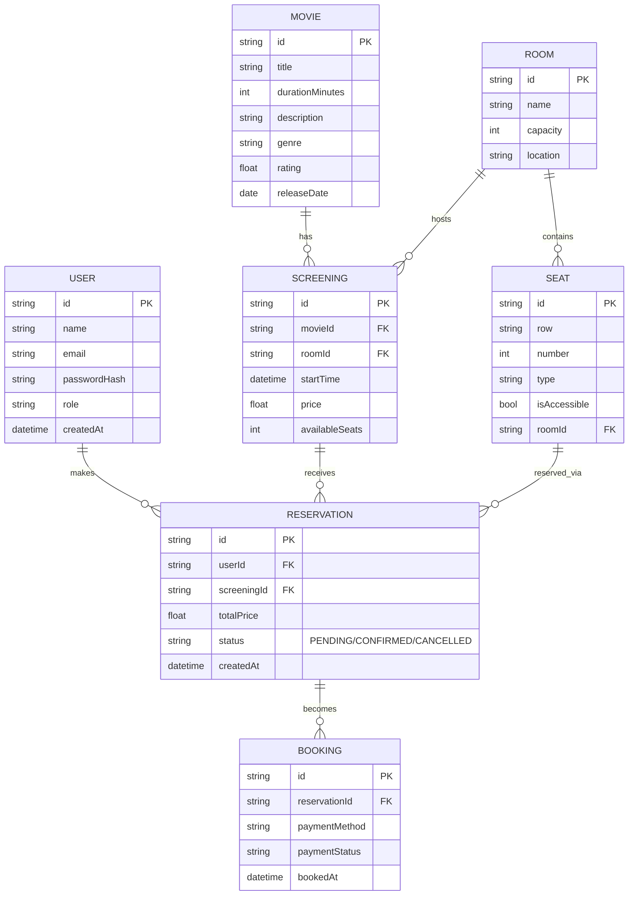

# Trabajo-Final-Integrador

Resumen
-------
Aplicación full-stack para la gestión de una sala de cine: catálogo de películas, gestión de salas, funciones (screenings), asientos, reservas y compras. Contiene Backend en TypeScript (Node + Express) y Frontend en React + Vite.

Estructura del proyecto
-----------------------
- [Backend](Backend)
  - [src/app.ts](Backend/src/app.ts)
  - [src/server.ts](Backend/src/server.ts)
  - Controladores: [Backend/src/controllers/auth.controller.ts](Backend/src/controllers/auth.controller.ts), [Backend/src/controllers/movie.controller.ts](Backend/src/controllers/movie.controller.ts), [Backend/src/controllers/screening.controller.ts](Backend/src/controllers/screening.controller.ts), [Backend/src/controllers/booking.controller.ts](Backend/src/controllers/booking.controller.ts), [Backend/src/controllers/reservation.controller.ts](Backend/src/controllers/reservation.controller.ts), [Backend/src/controllers/user.controller.ts](Backend/src/controllers/user.controller.ts)
  - Servicios: [Backend/src/services/movie.services.ts](Backend/src/services/movie.services.ts), [Backend/src/services/screening.services.ts](Backend/src/services/screening.services.ts), [Backend/src/services/booking.services.ts](Backend/src/services/booking.services.ts), [Backend/src/services/reservation.service.ts](Backend/src/services/reservation.service.ts), [Backend/src/services/user.services.ts](Backend/src/services/user.services.ts)
  - Modelos / entidades: [Backend/src/models/entities/movie.entity.ts](Backend/src/models/entities/movie.entity.ts), [Backend/src/models/entities/room.entity.ts](Backend/src/models/entities/room.entity.ts), [Backend/src/models/entities/screening.entity.ts](Backend/src/models/entities/screening.entity.ts), [Backend/src/models/entities/seat.entity.ts](Backend/src/models/entities/seat.entity.ts), [Backend/src/models/entities/reservation.entity.ts](Backend/src/models/entities/reservation.entity.ts), [Backend/src/models/entities/user.entity.ts](Backend/src/models/entities/user.entity.ts)
  - Rutas: [Backend/src/routes/movie.routes.ts](Backend/src/routes/movie.routes.ts), [Backend/src/routes/screening.routes.ts](Backend/src/routes/screening.routes.ts), [Backend/src/routes/booking.routes.ts](Backend/src/routes/booking.routes.ts), [Backend/src/routes/reservation.route.ts](Backend/src/routes/reservation.route.ts), [Backend/src/routes/auth.routes.ts](Backend/src/routes/auth.routes.ts), [Backend/src/routes/user.routes.ts](Backend/src/routes/user.routes.ts)
- [Frontend](Frontend)
  - Entrypoints: [Frontend/src/main.tsx](Frontend/src/main.tsx), [Frontend/src/App.tsx](Frontend/src/App.tsx)
  - Componentes clave: [Frontend/src/components/Cartelera.tsx](Frontend/src/components/Cartelera.tsx), [Frontend/src/components/BookingForm.tsx](Frontend/src/components/BookingForm.tsx), [Frontend/src/components/SeleccionAsientos.tsx](Frontend/src/components/SeleccionAsientos.tsx), [Frontend/src/components/BookingView.tsx](Frontend/src/components/BookingView.tsx), [Frontend/src/components/LoginRegister.tsx](Frontend/src/components/LoginRegister.tsx)
  - Contextos: [Frontend/src/contexts/AuthContext.tsx](Frontend/src/contexts/AuthContext.tsx)

Requisitos
----------
- Node.js >= 18
- npm o yarn

Cómo ejecutar (desarrollo)
--------------------------
Backend
1. Ir a la carpeta Backend:
   ```sh
   cd Backend
   ```
2. Instalar dependencias:
   ```sh
   npm install
   ```
3. Ejecutar (ejemplo):
   ```sh
   npm run dev
   ```

Frontend
1. Ir a la carpeta Frontend:
   ```sh
   cd Frontend
   ```
2. Instalar dependencias:
   ```sh
   npm install
   ```
3. Ejecutar:
   ```sh
   npm run dev
   ```
Aclaracion: para poder logearse dentro de la aplicacion como admin hay que usar el siguiente comando desde el cmd en backend: 
 ```sh
curl -X POST http://localhost:3000/api/seed -H "Content-Type: application/json"
  ```
Informacion para usuario y admin de prueba:
```
admin@example.com / admin
client@example.com / client
```

API y rutas principales
-----------------------
- Autenticación: [Backend/src/routes/auth.routes.ts](Backend/src/routes/auth.routes.ts)
- Películas: [Backend/src/routes/movie.routes.ts](Backend/src/routes/movie.routes.ts) -> controlador [Backend/src/controllers/movie.controller.ts](Backend/src/controllers/movie.controller.ts)
- Funciones / Screening: [Backend/src/routes/screening.routes.ts](Backend/src/routes/screening.routes.ts) -> [Backend/src/controllers/screening.controller.ts](Backend/src/controllers/screening.controller.ts)
- Reservas: [Backend/src/routes/reservation.route.ts](Backend/src/routes/reservation.route.ts) -> [Backend/src/controllers/reservation.controller.ts](Backend/src/controllers/reservation.controller.ts)
- Bookings / Compras: [Backend/src/routes/booking.routes.ts](Backend/src/routes/booking.routes.ts) -> [Backend/src/controllers/booking.controller.ts](Backend/src/controllers/booking.controller.ts)
- Usuarios: [Backend/src/routes/user.routes.ts](Backend/src/routes/user.routes.ts) -> [Backend/src/controllers/user.controller.ts](Backend/src/controllers/user.controller.ts)

Diagrama Entidad-Relación (ER)
------------------------------
A continuación se incluye un diagrama ER en formato Mermaid que representa las entidades principales, sus atributos más importantes y las relaciones.



Notas sobre el modelo de datos
-----------------------------
- RESERVATION -> SEAT es una relación muchos-a-muchos en la práctica: una reserva puede incluir varios asientos y un asiento puede reservarse en distintas funciones (screenings) en distintos horarios. Implementar con una tabla puente (por ejemplo reservation_seats).
- SCREENING referencia a MOVIE y ROOM.
- ROOM contiene SEATS fijos (fila, número). Para disponibilidad por función.
- BOOKING agrupa los datos de pago asociados a una RESERVATION finalizada.


Licencia y créditos
-------------------
Proyecto de fin de curso. 

Colección de endpoints (resumen)
-------------------------------
A continuación se listan los endpoints principales del Backend con método, ruta, breve descripción y si requieren autenticación.

Auth
- POST /auth/register — Registrar usuario. Body: { name, email, password } — No auth
- POST /auth/login — Login. Body: { email, password } — No auth
- GET  /auth/me — Obtener usuario autenticado — Auth requerido (Bearer token)

Movies
- GET  /movies — Listar películas — No auth
- GET  /movies/:id — Obtener película por id — No auth
- POST /movies — Crear película — Body: { title, durationMinutes, description, genre, releaseDate, rating } — Auth (admin)
- PUT  /movies/:id — Actualizar película — Auth (admin)
- DELETE /movies/:id — Eliminar película — Auth (admin)

Screenings (Funciones)
- GET  /screenings — Listar funciones (puede filtrar por movieId, roomId, date) — No auth
- GET  /screenings/:id — Obtener función por id — No auth
- POST /screenings — Crear función. Body: { movieId, roomId, startTime, price } — Auth (admin)
- PUT  /screenings/:id — Actualizar función — Auth (admin)
- DELETE /screenings/:id — Eliminar función — Auth (admin)

Rooms y Seats (si expuestos)
- GET  /rooms — Listar salas — No auth
- GET  /rooms/:id — Detalle sala y asientos — No auth
- POST/PUT/DELETE /rooms* — CRUD salas — Auth (admin)
- POST/PUT/DELETE /rooms/:roomId/seats* — CRUD asientos — Auth (admin)

Reservations
- POST /reservations — Crear reserva. Body: { screeningId, userId(optional if auth), seats: [seatId], totalPrice } — Auth o guest según implementación
- GET  /reservations — Listar reservas (admin o usuario filtrado) — Auth
- GET  /reservations/:id — Obtener reserva por id — Auth (propietario o admin)
- PUT  /reservations/:id/cancel — Cancelar reserva — Auth (propietario)

Bookings /
- POST /bookings — Completar reserva / procesar pago. Body: { reservationId, paymentMethod, paymentData } — Auth
- GET  /bookings — Obtener info de booking — Auth (propietario o admin)

Users
- GET  /users — Listar usuarios — Auth (admin)
- GET  /users/:id — Obtener usuario — Auth (admin o propietario)
- POST /users — Crear usuario (admin) — Body: { name, email, role }
- PUT  /users/:id — Actualizar usuario — Auth (admin o propietario)
- DELETE /users/:id — Borrar usuario — Auth (admin)

Seed / Utilidades
- POST /seed — Cargar datos de ejemplo — Auth (admin) / Usado en desarrollo

Integrantes
-------------------------------------------------------------------
.Franco Julian Rossi

.Manuel Galdames

.Santiago Recaria

.Martin Andres Garnica
=======
# Trabajo-Final-Integrador

