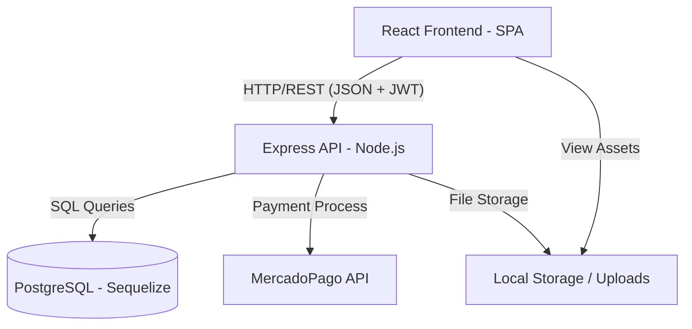
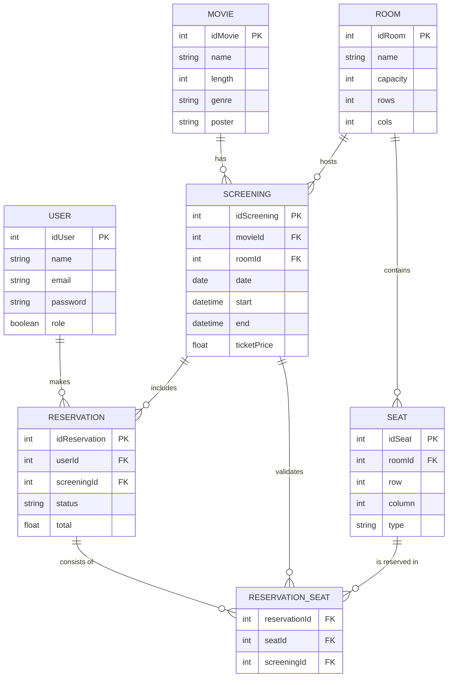
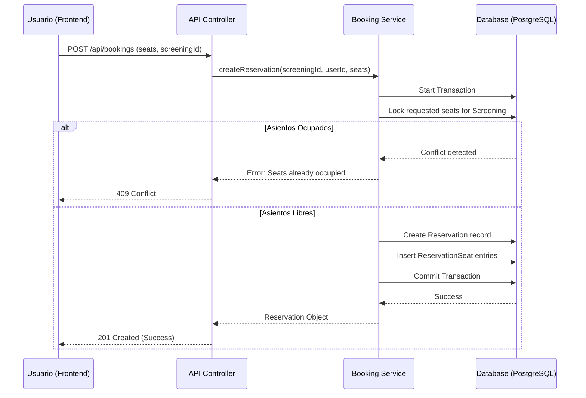
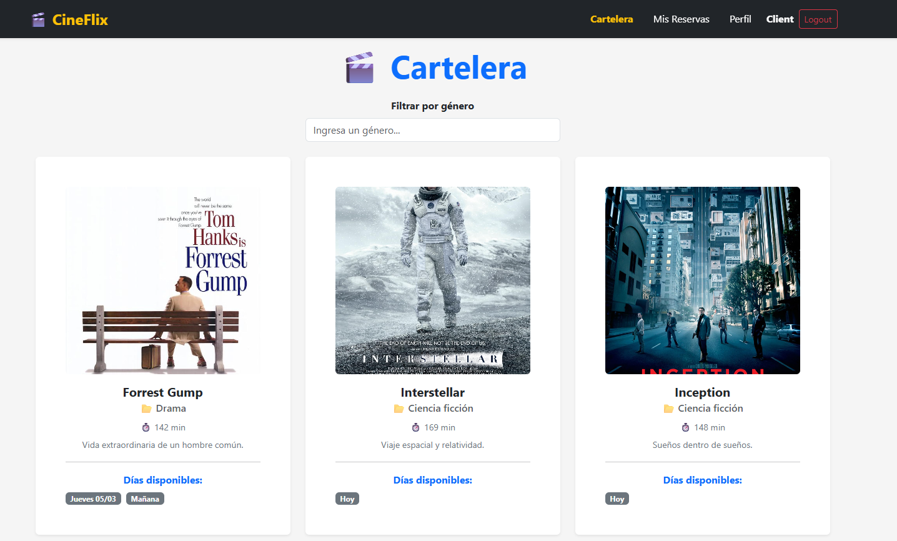
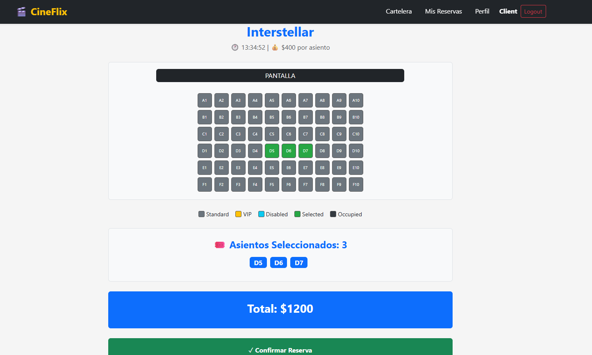
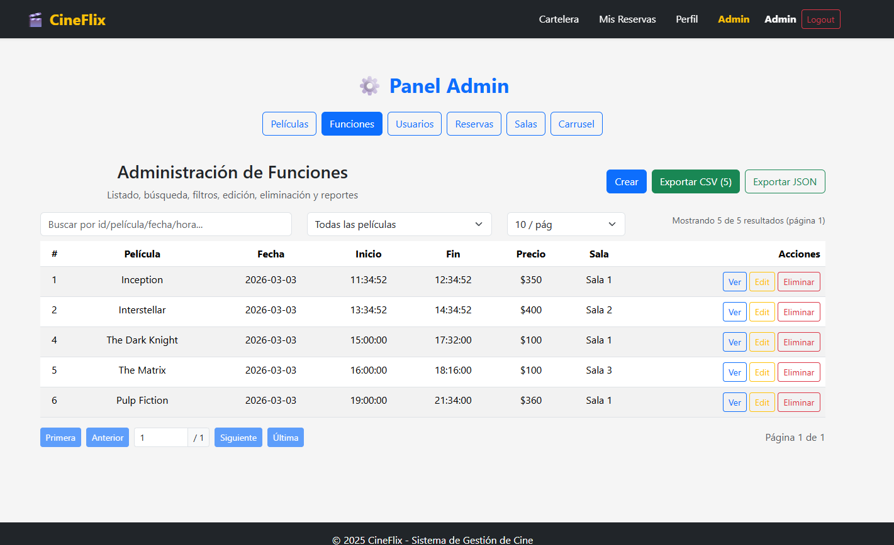

# Cinema Booking & Management System - Fullstack Application

## 1. Resumen Ejecutivo y Stack Tecnológico

### Descripción General

Este proyecto es una plataforma integral para la gestión de cines y reserva de entradas. Permite a los administradores gestionar el catálogo de películas, configurar salas y asientos, y programar funciones (screenings). Los usuarios finales pueden navegar por la cartelera, seleccionar funciones, elegir sus asientos en tiempo real a través de una interfaz interactiva y completar el proceso de compra con integración de pagos. El sistema garantiza la integridad de los datos mediante el uso de transacciones y bloqueos a nivel de base de datos para evitar la sobreventa de asientos.

### Tech Stack

Basado en el análisis de las dependencias, el sistema utiliza las siguientes tecnologías clave:

**Backend:**

- **Runtime:** Node.js con TypeScript.
- **Framework:** Express.js (v5.1.0).
- **ORM:** Sequelize con `sequelize-typescript` para un modelado de datos robusto y tipado.
- **Base de Datos:** PostgreSQL.
- **Autenticación:** JSON Web Tokens (JWT) y Bcryptjs para el hashing de contraseñas.
- **Pagos:** MercadoPago SDK.
- **Middleware:** Multer para la gestión de subida de archivos (posters de películas y carrusel).
- **Testing:** Jest y Supertest.

**Frontend:**

- **Framework:** React (v19.2.0) con TypeScript.
- **Build Tool:** Vite.
- **Routing:** React Router DOM (v7.13.0).
- **Styling:** Bootstrap 5 y React-Bootstrap para una UI responsiva y profesional.
- **Animaciones:** Framer Motion.
- **Componentes UI:** Swiper (Carruseles), Lucide React (Iconografía).
- **Testing:** Vitest y React Testing Library con MSW (Mock Service Worker) para simular la API.

---

## 2. Arquitectura del Sistema

### Diagrama de Arquitectura

El sistema sigue una arquitectura cliente-servidor clásica con persistencia en una base de datos relacional y servicios externos de terceros.


```mermaid
graph TD
    Client[React Frontend - SPA]
    API[Express API - Node.js]
    DB[(PostgreSQL - Sequelize)]
    MP[MercadoPago API]
    Storage[Local Storage / Uploads]

    Client -- HTTP/REST (JSON + JWT) --> API
    API -- SQL Queries --> DB
    API -- Payment Process --> MP
    API -- File Storage --> Storage
    Client -- View Assets --> Storage
```

### Flujo Breve (Brief Flow)

1. **Acción del Usuario:** El usuario selecciona una función y elige sus asientos en el Frontend.
2. **Petición a la API:** El cliente envía una petición `POST /api/bookings` incluyendo el token JWT y los datos de la reserva.
3. **Persistencia en DB:** El servidor valida la disponibilidad de los asientos dentro de una transacción de base de datos para asegurar la atomicidad.
4. **Respuesta:** La API confirma la reserva y el cliente redirige al usuario al flujo de pago o muestra un resumen del éxito de la operación.

---

## 3. Modelo de Dominio y Base de Datos

### Diagrama ER (Entidad-Relación)

El modelo de datos está diseñado para soportar la complejidad de las reservas de asientos por función específica.


```mermaid
erDiagram
    USER ||--o{ RESERVATION : "makes"
    MOVIE ||--o{ SCREENING : "has"
    ROOM ||--o{ SCREENING : "hosts"
    ROOM ||--o{ SEAT : "contains"
    SCREENING ||--o{ RESERVATION : "includes"
    RESERVATION ||--o{ RESERVATION_SEAT : "consists of"
    SEAT ||--o{ RESERVATION_SEAT : "is reserved in"
    SCREENING ||--o{ RESERVATION_SEAT : "validates"

    USER {
        int idUser PK
        string name
        string email
        string password
        boolean role
    }
    MOVIE {
        int idMovie PK
        string name
        int length
        string genre
        string poster
    }
    ROOM {
        int idRoom PK
        string name
        int capacity
        int rows
        int cols
    }
    SEAT {
        int idSeat PK
        int roomId FK
        int row
        int column
        string type
    }
    SCREENING {
        int idScreening PK
        int movieId FK
        int roomId FK
        date date
        datetime start
        datetime end
        float ticketPrice
    }
    RESERVATION {
        int idReservation PK
        int userId FK
        int screeningId FK
        string status
        float total
    }
    RESERVATION_SEAT {
        int reservationId FK
        int seatId FK
        int screeningId FK
    }
```

### Relaciones Clave

- **Salas y Asientos (1:N):** Cada sala tiene una configuración fija de asientos definida por filas y columnas.
- **Funciones (Screenings):** Actúa como la entidad central que relaciona una Película, una Sala y un Horario específico.
- **Reservas y Asientos Reservados (1:N y N:M indirecto):** Una reserva puede incluir múltiples asientos. La tabla `ReservationSeat` actúa como tabla intermedia pero también incluye el `screeningId` para aplicar una restricción de unicidad (`screeningId` + `seatId`), impidiendo que el mismo asiento sea vendido dos veces para la misma función.

---

## 4. Casos de Uso y Flujos Principales

### Casos de Uso

- **Actores (Usuarios):**
  - Consultar cartelera y detalles de películas.
  - Seleccionar asientos disponibles de forma interactiva.
  - Realizar reservas y gestionar historial de compras.
- **Actores (Administradores):**
  - Gestión de catálogo de películas (CRUD con subida de imágenes).
  - Configuración de salas y distribución de asientos.
  - Programación de funciones y gestión de precios.
  - Visualización y gestión de todas las reservas del sistema.

### Diagrama de Secuencia: Creación de Reserva

Este flujo muestra la operación crítica de asegurar asientos para una función.


```mermaid
sequenceDiagram
    participant U as Usuario (Frontend)
    participant A as API Controller
    participant S as Booking Service
    participant DB as Database (PostgreSQL)

    U->>A: POST /api/bookings (seats, screeningId)
    A->>S: createReservation(screeningId, userId, seats)
    S->>DB: Start Transaction
    S->>DB: Lock requested seats for Screening
    alt Asientos Ocupados
        DB-->>S: Conflict detected
        S-->>A: Error: Seats already occupied
        A-->>U: 409 Conflict
    else Asientos Libres
        S->>DB: Create Reservation record
        S->>DB: Insert ReservationSeat entries
        S->>DB: Commit Transaction
        DB-->>S: Success
        S-->>A: Reservation Object
        A-->>U: 201 Created (Success)
    end
```

---

## 5. Análisis Técnico Destacado

### Fragmento de Código: Manejo de Transacciones y Bloqueos

Se ha seleccionado el método `createReservation` en `booking.services.ts` por su implementación de seguridad y consistencia de datos.

```typescript
// Backend/src/services/booking.services.ts (Simplificado)
async createReservation(screeningId: number, userId: number, seats: { row: number, column: number }[]) {
    const t = await sequelize.transaction();
    try {
        // ... búsqueda de asientos ...

        // Bloqueo de filas para prevenir inserciones concurrentes en los mismos asientos
        const occupied = await ReservationSeat.findAll({
            where: { seatId: seatInstances.map(s => s.idSeat) },
            include: [{
                model: Reservation,
                where: { screeningId, status: { [Op.or]: ["Pending", "Confirmed", "Paid"] } }
            }],
            transaction: t,
            lock: t.LOCK.UPDATE, // Bloqueo selectivo
        });

        if (occupied.length > 0) throw new Error("Some seats are already occupied");

        // ... creación de reserva y bulkCreate de asientos ...

        await t.commit();
        return reservation;
    } catch (error) {
        await t.rollback();
        throw error;
    }
}
```

**Explicación del Diseño:**
El uso de `t.LOCK.UPDATE` dentro de una transacción de Sequelize es vital en este dominio. Previene la condición de carrera donde dos usuarios intentan reservar el mismo asiento al mismo tiempo. Al bloquear las filas de `ReservationSeat` asociadas, el sistema garantiza que la validación de "Asientos Libres" sea atómica y segura para concurrencia masiva.

---

## 6. Interfaz y Ejemplos (Placeholders)

### UI Screenshots


_Vista de la cartelera y filtros de películas._


_Mapa interactivo de la sala permitiendo selección múltiple de asientos._


_Panel de administrador_

### Ejemplo de JSON Payload (API Output)

Respuesta típica tras una reserva exitosa:

```json
{
  "idReservation": 125,
  "userId": 10,
  "screeningId": 45,
  "status": "Confirmed",
  "total": 4500.0,
  "reservationDate": "2026-03-03T15:30:00.000Z",
  "reservationSeats": [
    { "seatId": 501, "screeningId": 45 },
    { "seatId": 502, "screeningId": 45 }
  ]
}
```

---

## Integrantes

- #### Franco Julian Rossi

- #### Manuel Galdames

- #### Santiago Recari

- #### Martin Andres Garnica

<br>
